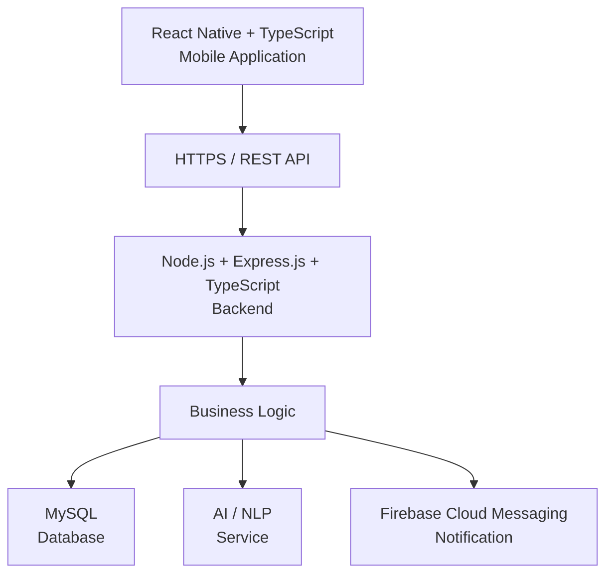
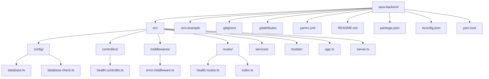
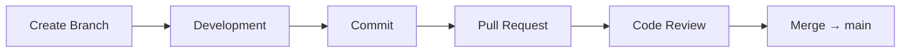
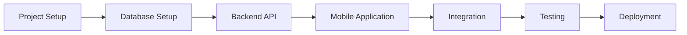
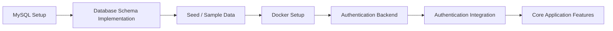

````md
# SARA Backend

Backend service untuk **SARA — Smart Assistant for Responsive Automation**.

Backend ini dikembangkan menggunakan Node.js, Express.js, dan TypeScript untuk menyediakan REST API yang digunakan oleh mobile application SARA.

---

## Tech Stack

| Komponen             | Teknologi        |
| -------------------- | ---------------- |
| Runtime              | Node.js 22.21.1  |
| Backend Framework    | Express.js       |
| Programming Language | TypeScript 7.0.2 |
| Development Runner   | tsx 4.23.15      |
| Package Manager      | Yarn 3.6.3       |
| Database             | MySQL 8.0        |
| API Style            | REST API         |

---

## Dependencies

### Production Dependencies

- `express`
- `cors`
- `dotenv`
- `mysql2`

### Development Dependencies

- `typescript`
- `tsx`
- `@types/node`
- `@types/express`
- `@types/cors`
- `prettier`

Versi dependency mengikuti konfigurasi pada `package.json` dan `yarn.lock`.

---

## Requirements

Pastikan environment berikut sudah tersedia sebelum menjalankan project:

- Node.js 22.x
- Yarn 3.x
- Git
- MySQL 8.0.x

Cek versi:

```bash
node -v
yarn -v
git --version
mysql --version
````

Environment development yang digunakan:

```text
Node.js 22.21.1
Yarn 3.6.3
MySQL 8.0.30
```

---

## Installation

### Clone Repository

Clone repository backend SARA:

```bash
git clone https://github.com/ryanazryan/sara-backend.git
```

Masuk ke directory project:

```bash
cd sara-backend
```

### Install Dependencies

Install seluruh dependency menggunakan Yarn:

```bash
yarn install
```

---

## Database Setup

SARA Backend menggunakan **MySQL** sebagai DBMS utama.

### 1. Pastikan MySQL Aktif

Pastikan MySQL Server sedang berjalan.

Konfigurasi default yang digunakan oleh project:

```text
Host     : localhost
Port     : 3306
Username : root
Database : sara
```

### 2. Cek Instalasi MySQL

Jalankan:

```bash
mysql --version
```

Contoh output:

```text
C:\laragon\bin\mysql\mysql-8.0.30-winx64\bin\mysql.exe
Ver 8.0.30 for Win64
```

### 3. Login ke MySQL

Jalankan:

```bash
mysql -u root -p
```

Masukkan password MySQL.

Apabila user `root` tidak menggunakan password, tekan `Enter` ketika diminta password.

### 4. Membuat Database SARA

Setelah berhasil masuk ke MySQL, buat database:

```sql
CREATE DATABASE sara
CHARACTER SET utf8mb4
COLLATE utf8mb4_unicode_ci;
```

Verifikasi database:

```sql
SHOW DATABASES;
```

Pastikan database berikut tersedia:

```text
sara
```

### 5. Menggunakan Database SARA

```sql
USE sara;
```

Untuk memastikan database yang sedang digunakan:

```sql
SELECT DATABASE();
```

Expected result:

```text
sara
```

### 6. Keluar dari MySQL

Setelah konfigurasi database selesai:

```sql
exit;
```

---

## Environment Configuration

Buat file `.env` berdasarkan `.env.example`.

Contoh:

```env
PORT=3000

DB_HOST=localhost
DB_PORT=3306
DB_NAME=sara
DB_USER=root
DB_PASSWORD=
```

Keterangan:

| Variable      | Keterangan                       |
| ------------- | -------------------------------- |
| `PORT`        | Port yang digunakan oleh backend |
| `DB_HOST`     | Host MySQL                       |
| `DB_PORT`     | Port MySQL                       |
| `DB_NAME`     | Nama database                    |
| `DB_USER`     | Username MySQL                   |
| `DB_PASSWORD` | Password MySQL                   |

Sesuaikan `DB_USER` dan `DB_PASSWORD` dengan konfigurasi MySQL pada environment masing-masing.

> Jangan commit file `.env` ke repository. Gunakan `.env.example` sebagai template konfigurasi environment.

---

## Database Connection Check

Project menyediakan command khusus untuk melakukan pengecekan koneksi antara backend dan MySQL.

Jalankan:

```bash
yarn db:check
```

Jika koneksi berhasil, output akan menunjukkan:

```text
MySQL connection successful
[ { result: 1 } ]
```

Proses pengecekan:

```text
SARA Backend
      │
      ▼
Node.js + mysql2
      │
      ▼
MySQL Server
      │
      ▼
Database "sara"
```

---

## Menjalankan Aplikasi

### Development

Jalankan development server:

```bash
yarn dev
```

Backend akan berjalan pada:

```text
http://localhost:3000
```

### Production Build

Compile project TypeScript:

```bash
yarn build
```

Hasil build akan berada di directory:

```text
dist/
```

Jalankan hasil build:

```bash
yarn start
```

---

## Type Checking

Untuk melakukan pengecekan TypeScript tanpa menghasilkan file build:

```bash
yarn typecheck
```

---

## Code Formatting

Project menggunakan **Prettier** untuk menjaga konsistensi formatting kode.

### Format Source Code

```bash
yarn format
```

### Check Formatting

```bash
yarn format:check
```

> `yarn format:check` digunakan sebagai validasi formatting dan tidak mengubah file.

---

## API Health Check

Backend menyediakan endpoint untuk mengecek apakah service berjalan dengan baik.

### Endpoint

```http
GET /api/health
```

Akses melalui:

```text
http://localhost:3000/api/health
```

Response:

```json
{
  "success": true,
  "message": "SARA Backend is running"
}
```

---

## Development Scripts

| Command             | Keterangan                                       |
| ------------------- | ------------------------------------------------ |
| `yarn dev`          | Menjalankan development server dengan watch mode |
| `yarn build`        | Melakukan compile TypeScript                     |
| `yarn start`        | Menjalankan hasil build                          |
| `yarn typecheck`    | Melakukan pengecekan TypeScript                  |
| `yarn db:check`     | Mengecek koneksi backend ke MySQL                |
| `yarn format`       | Memformat file menggunakan Prettier              |
| `yarn format:check` | Mengecek format file menggunakan Prettier        |

---

## Arsitektur Backend



Backend SARA dirancang untuk menangani:

* Authentication
* Activity Management
* Schedule Management
* Activity History
* Reminder
* Notification Processing
* Recommendation
* AI/NLP Integration

---

## Struktur Project



---

## Backend Layer

Struktur backend menggunakan pemisahan tanggung jawab berdasarkan layer.

### Config

Directory:

```text
src/config/
```

Digunakan untuk konfigurasi aplikasi, termasuk koneksi database.

File utama:

```text
database.ts
```

Berfungsi membuat MySQL connection pool menggunakan `mysql2`.

File pengecekan:

```text
database-check.ts
```

Digunakan untuk melakukan validasi koneksi backend ke database MySQL.

### Controllers

Directory:

```text
src/controllers/
```

Digunakan untuk menangani HTTP request dan memberikan HTTP response.

Contoh:

```text
health.controller.ts
```

### Routes

Directory:

```text
src/routes/
```

Digunakan untuk mendefinisikan endpoint API dan menghubungkan route dengan controller.

Contoh:

```text
health.routes.ts
```

### Middlewares

Directory:

```text
src/middlewares/
```

Digunakan untuk middleware yang berjalan pada request pipeline.

Contoh:

```text
error.middleware.ts
```

### Services

Directory:

```text
src/services/
```

Disiapkan untuk business logic aplikasi.

### Models

Directory:

```text
src/models/
```

Disiapkan untuk representasi data dan integrasi model aplikasi.

---

## Version Control

Project menggunakan:

* Git
* GitHub
* Trunk-Based Development

### Branch Utama

```text
main
```

Branch `main` digunakan sebagai central integration branch.

### Short-Lived Branch

```text
feature/*
fix/*
chore/*
```

Contoh:

```text
feature/mysql-setup
feature/authentication
feature/activity-api
fix/database-connection
chore/update-dependencies
```

### Alur Development



Branch `main` digunakan sebagai central integration branch.

---

## Related Repository

### SARA Mobile

Repository untuk mobile application SARA:

```text
https://github.com/willysuyanto/sara-mobile
```

Technology:

```text
React Native + TypeScript
```

### SARA Backend

Repository untuk backend service SARA:

```text
https://github.com/ryanazryan/sara-backend
```

Technology:

```text
Node.js + Express.js + TypeScript
```

---

## Project Documentation

Dokumentasi lengkap project SARA dikelola pada Notion:

```text
https://app.notion.com/p/SARA-3e173f8cd49980d0b374eb7ee56e5afe
```

---

## Project Status

Project SARA berada pada tahap **Software Construction**.

Tahapan pengembangan:



Status backend saat ini:

```text
Backend Repository Setup     → Completed
Backend API Foundation       → Completed
MySQL Setup                  → In Progress
Database Schema              → Planned
```

---

## Current Backend Foundation

Backend foundation saat ini menyediakan:

```text
Express.js Application
        │
        ├── CORS
        ├── JSON Request Parser
        ├── REST API Routes
        ├── Error Middleware
        └── Health Check
```

Database foundation menyediakan:

```text
MySQL 8.0
    │
    └── Database: sara
            │
            └── mysql2 Connection Pool
```

---

## Next Development Phase

Setelah MySQL setup selesai dan tervalidasi, tahap berikutnya adalah implementasi database schema.

Development flow berikutnya:



Database schema akan dikembangkan berdasarkan requirement, use case, class/data model, dan kebutuhan fitur SARA.

---

## Validation Checklist

Sebelum membuat Pull Request, lakukan validation berikut:

```bash
yarn typecheck
yarn build
yarn db:check
yarn format:check
```

Expected validation:

```text
TypeScript typecheck       → Passed
Production build           → Passed
MySQL connection check     → Passed
Prettier format check      → Passed
```

---

## License

Project ini dibuat untuk keperluan **Tugas Besar / perkuliahan Implementasi dan Pengujian Perangkat Lunak**.

```
```
