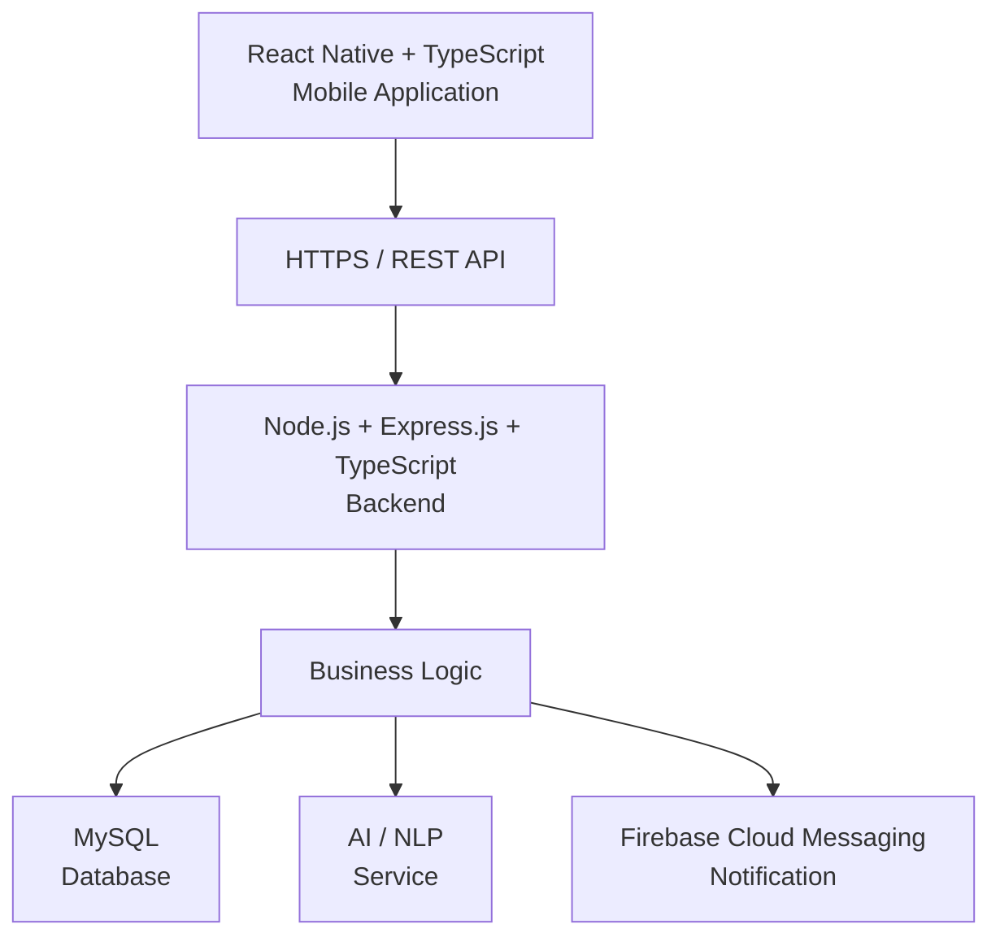
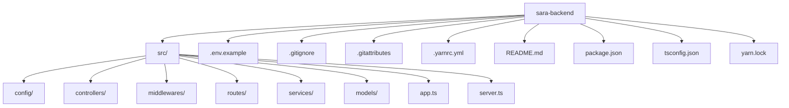
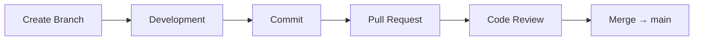
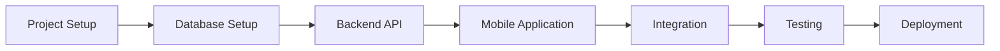

# SARA Backend

Backend service untuk **SARA — Smart Assistant for Responsive Automation**.

Backend ini dikembangkan menggunakan Node.js, Express.js, dan TypeScript untuk menyediakan REST API yang digunakan oleh mobile application SARA.

---

## Tech Stack

| Komponen             | Teknologi        |
| -------------------- | ---------------- |
| Runtime              | Node.js 22.21.1  |
| Backend Framework    | Express.js       |
| Programming Language | TypeScript 7.0.2 |
| Development Runner   | tsx 4.23.15      |
| Package Manager      | Yarn 3.6.3       |
| Database             | MySQL            |
| API Style            | REST API         |

---

## Dependencies

### Production Dependencies

- `express`
- `cors`
- `dotenv`

### Development Dependencies

- `typescript`
- `tsx`
- `@types/node`
- `@types/express`
- `@types/cors`

Versi dependency mengikuti konfigurasi pada `package.json` dan `yarn.lock`.

---

## Requirements

Pastikan environment berikut sudah tersedia sebelum menjalankan project:

- Node.js 22.x
- Yarn 3.x
- Git
- MySQL

Cek versi:

```bash
node -v
yarn -v
git --version
```

Environment development yang digunakan:

```text
Node.js 22.21.1
Yarn 3.6.3
```

---

## Installation

Clone repository:

```bash
git clone https://github.com/[USERNAME]/sara-backend.git
```

Masuk ke directory project:

```bash
cd sara-backend
```

Install dependencies:

```bash
yarn install
```

---

## Environment Configuration

Buat file `.env` berdasarkan `.env.example`.

Contoh:

```env
PORT=3000

DB_HOST=localhost
DB_PORT=3306
DB_NAME=sara
DB_USER=root
DB_PASSWORD=
```

Keterangan:

| Variable      | Keterangan                       |
| ------------- | -------------------------------- |
| `PORT`        | Port yang digunakan oleh backend |
| `DB_HOST`     | Host MySQL                       |
| `DB_PORT`     | Port MySQL                       |
| `DB_NAME`     | Nama database                    |
| `DB_USER`     | Username MySQL                   |
| `DB_PASSWORD` | Password MySQL                   |

> Jangan commit file `.env` ke repository. Gunakan `.env.example` sebagai template konfigurasi environment.

---

## Menjalankan Aplikasi

### Development

Jalankan development server:

```bash
yarn dev
```

Backend akan berjalan pada:

```text
http://localhost:3000
```

### Production Build

Compile project TypeScript:

```bash
yarn build
```

Hasil build akan berada di directory:

```text
dist/
```

Jalankan hasil build:

```bash
yarn start
```

---

## Type Checking

Untuk melakukan pengecekan TypeScript tanpa menghasilkan file build:

```bash
yarn typecheck
```

---

## API Health Check

Backend menyediakan endpoint untuk mengecek apakah service berjalan dengan baik.

### Endpoint

```http
GET /api/health
```

Akses melalui:

```text
http://localhost:3000/api/health
```

Response:

```json
{
  "success": true,
  "message": "SARA Backend is running"
}
```

---

## Development Scripts

| Command          | Keterangan                                       |
| ---------------- | ------------------------------------------------ |
| `yarn dev`       | Menjalankan development server dengan watch mode |
| `yarn build`     | Melakukan compile TypeScript                     |
| `yarn start`     | Menjalankan hasil build                          |
| `yarn typecheck` | Melakukan pengecekan TypeScript                  |

---

## Arsitektur Backend



Backend SARA dirancang untuk menangani:

- Authentication
- Activity Management
- Schedule Management
- Activity History
- Reminder
- Notification Processing
- Recommendation
- AI/NLP Integration

---

## Struktur Project



---

## Version Control

Project menggunakan:

- Git
- GitHub
- Trunk-Based Development

### Branch Utama

```text
main
```

### Short-Lived Branch

```text
feature/*
fix/*
chore/*
```

### Alur Development



Branch `main` digunakan sebagai central integration branch.

---

## Related Repository

### SARA Mobile

Repository untuk mobile application SARA:

```text
https://github.com/willysuyanto/sara-mobile
```

Technology:

```text
React Native + TypeScript
```

### SARA Backend

Repository untuk backend service SARA:

```text
https://github.com/[USERNAME]/sara-backend
```

Technology:

```text
Node.js + Express.js + TypeScript
```

---

## Project Documentation

Dokumentasi lengkap project SARA dikelola pada Notion:

```text
https://app.notion.com/p/SARA-3e173f8cd49980d0b374eb7ee56e5afe
```

---

## Project Status

Project SARA berada pada tahap **Software Construction**.

Tahapan pengembangan:



---

## License

Project ini dibuat untuk keperluan **Tugas Besar / perkuliahan Implementasi dan Pengujian Perangkat Lunak**.
